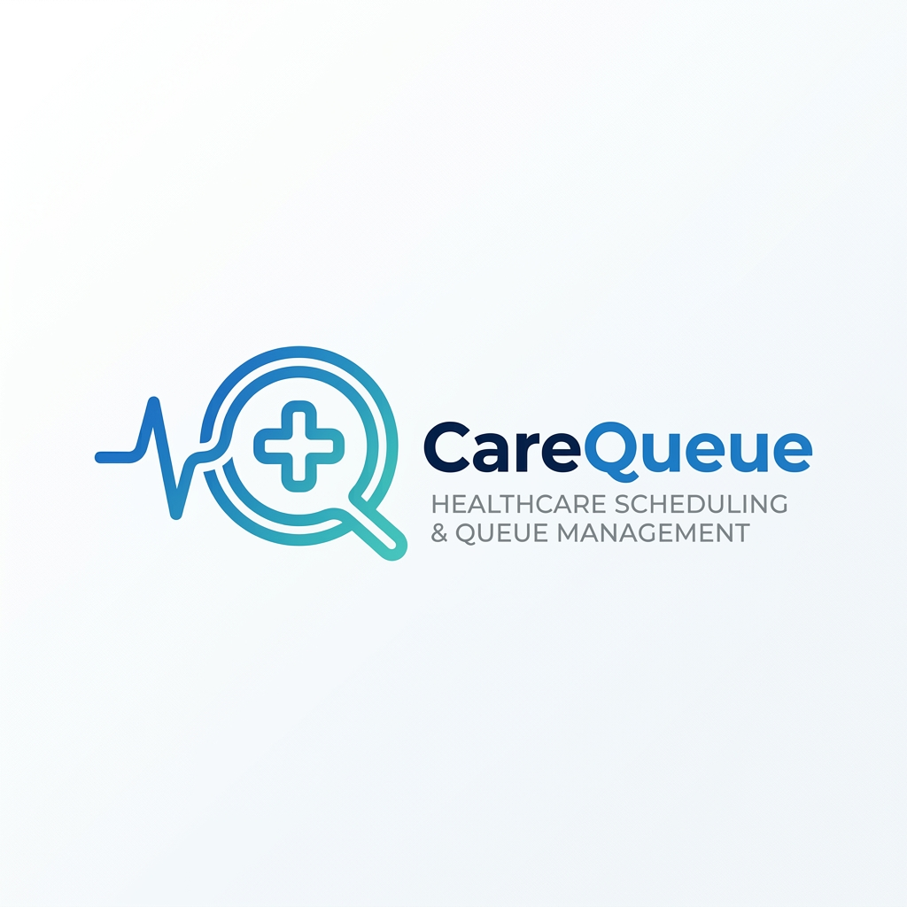

#  CareQueue

### The Future of Clinical Queue Management

**CareQueue** is a state-of-the-art clinical queue management system designed to eliminate physical waiting lines in hospitals. It provides a seamless, multi-channel experience for patients to join queues, while providing doctors with a powerful real-time dashboard to manage patient flow with precision and empathy.

---

## 🚀 Demo Links
- [Watch the CareQueue Demo on YouTube](https://youtube.com/shorts/eRV3PGDkB5s?si=GDYaNTKNXyD0JDbT)

---

## ✨ Key Features
- **Real-time Synchronization**: Powered by Socket.io for zero-latency queue updates.
- **Multi-channel Check-in**: Join via Mobile App, QR Code scanning, or Interactive Voice Response (IVR).
- **AI-Driven IVR Simulator**: Integrated text-to-speech and speech-to-text for non-digital patient accessibility.
- **Clinical Dashboards**: Specialized views for Doctors (queue management) and Patients (status tracking).
- **Medical Record Management**: Securely upload and manage prescriptions and clinical documents.
- **Smart Notifications**: Automated turn alerts via local SMS simulation and push notifications.

---

## 🛠️ Tech Stack
- **Frontend**: React Native (Expo), TypeScript, React Navigation, Socket.io-client.
- **Backend**: Node.js, Express.js, MongoDB, Mongoose, Socket.io.
- **Real-time**: WebSockets (Socket.io) for live event broadcasting.
- **Accessibility**: Expo Speech (TTS) and custom IVR logic.
- **Styling**: Premium Design System using HSL colors and modern glassmorphism effects.

---

## 📦 Installation & Setup

### 1. Prerequisites
- Node.js (v18+)
- MongoDB Atlas account or local MongoDB instance
- Expo Go app on your mobile device

### 2. Clone & Install
```bash
git clone https://github.com/sarthak9569/carequeue.git
cd carequeue
npm install
cd backend
npm install
```

### 3. Environment Configuration
Create a `.env` file in the `backend/` directory:
```env
PORT=5000
MONGO_URI=your_mongodb_uri
JWT_SECRET=your_secret_key
```

### 4. Run the Project
**Start Backend:**
```bash
cd backend
npm run dev
```

**Start Mobile Frontend:**
```bash
cd ..
npx expo start
```

---

## 📖 Usage
1. **Patients**: Sign up and select a clinical department (e.g., Cardiology, OPD) to join the live queue.
2. **Doctors**: Login with clinical credentials (e.g., `DOC123`) to see the waiting list and call the next patient.
3. **QR Check-in**: Use the in-app scanner at the hospital desk for instant registration.
4. **IVR Simulator**: Use the floating phone icon to experience voice-guided registration.

---

## 📂 Project Structure
```text
├── backend/            # Express server, MongoDB models, and API routes
├── src/                # React Native frontend source code
│   ├── components/     # Reusable UI components
│   ├── context/        # Auth and Queue state management
│   ├── navigation/     # App routing logic
│   ├── screens/        # Screen components (Dashboard, Profile, etc.)
│   └── services/       # API and Socket communication services
├── assets/             # Images, fonts, and static resources
└── App.tsx             # Main entry point for the mobile app
```

---

## 📡 API Documentation (Core Endpoints)

| Method | Endpoint | Description |
| :--- | :--- | :--- |
| `POST` | `/api/auth/register` | Register a new patient account |
| `POST` | `/api/auth/login` | Login patient or doctor |
| `GET` | `/api/queue` | Get live queue status for all departments |
| `POST` | `/api/queue/join` | Generate a new medical token |
| `GET` | `/api/prescriptions` | Fetch patient medical documents |

---

## 📜 License
This project is licensed under the **MIT License**.

---

## 👤 Contact / Author
**Sarthak Srivastava**  
- **GitHub**: [@sarthak9569](https://github.com/sarthak9569)  
- **Email**: [sarthak93693@gmail.com](mailto:sarthak93693@gmail.com)  

---
*Created with ❤️ for a better healthcare experience.*
